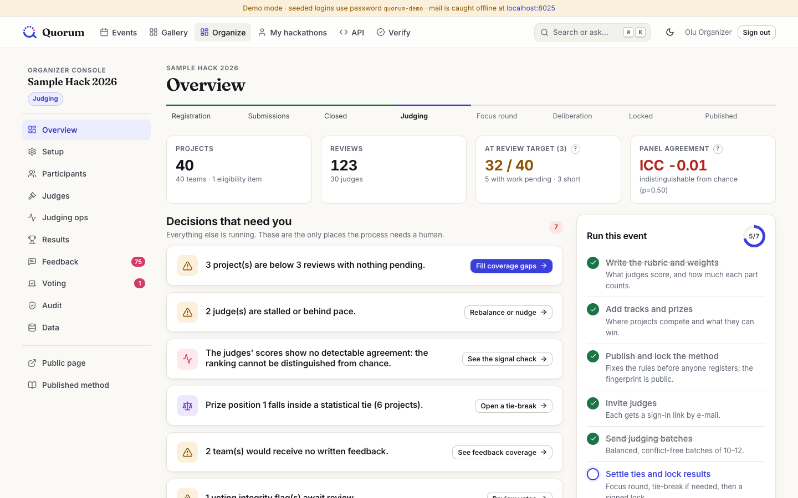
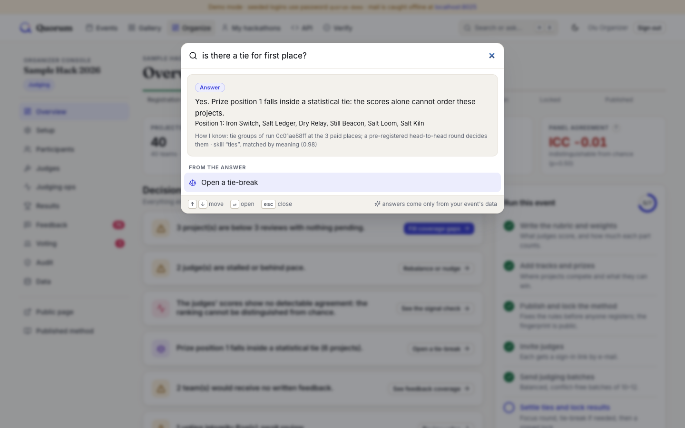
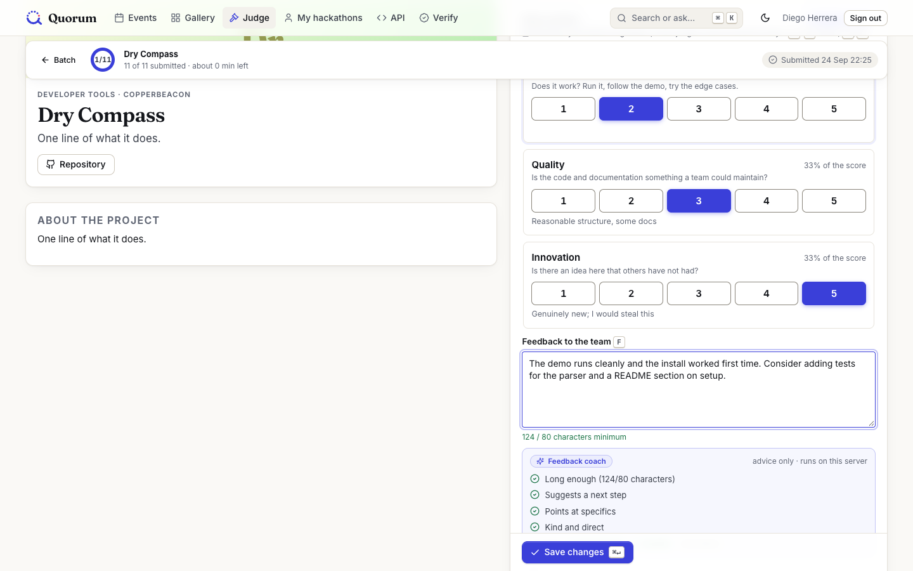
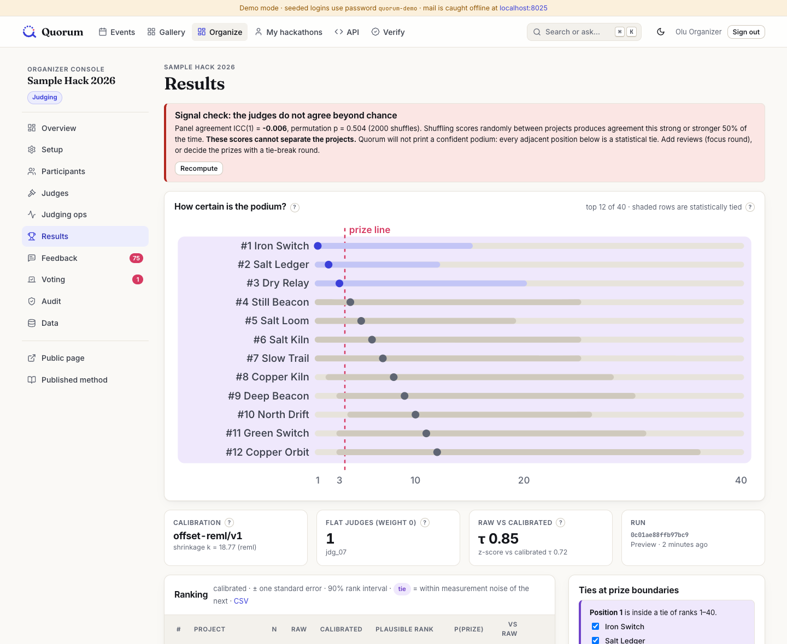

<p align="center">
  <picture>
    <source media="(prefers-color-scheme: dark)" srcset="docs/brand/quorum-lockup-dark.svg">
    
  </picture>
</p>

<p align="center"><strong>Every project judged. Every tie decided. Every team answered.</strong></p>

<p align="center">
  <a href="https://quorum-production-646e.up.railway.app"><b>Live demo</b></a> ·
  <a href="#run-it"><b>Run it</b></a> ·
  <a href="#five-minutes-with-the-fixture">Five minute tour</a> ·
  <a href="ARCHITECTURE.md">Architecture</a> ·
  <a href="JUDGING.md">Judging method</a> ·
  <a href="docs/proof/README.md">Normalization proof</a> ·
  <a href="THREAT-MODEL.md">Threat model</a> ·
  <a href="VERIFICATION.md">Verification</a> ·
  <a href="OPERATIONS.md">Operations</a> ·
  <a href="docs/DEMO.md">Demo script</a>
</p>

| For judges: you want to… | Go to |
|---|---|
| **Try it now, nothing to install** | **[Live demo](https://quorum-production-646e.up.railway.app)**: one click to be the organizer, a judge or a participant. It resets every hour and sends no e-mail |
| **Run it yourself** | [`docker compose up`](#run-it): seeded with the official fixture, works with the network off |
| **See every tier working** | [What is built](#what-is-built) · [official checker, 7/7](acceptance-report.txt) · [T3/T4 checker, 21/21](acceptance-report-extended.txt) |
| **Check the judging maths** | [JUDGING.md](JUDGING.md) · [normalization proof](docs/proof/README.md): raw vs normalized scores, rank changes, the method defended |
| **Check security and isolation** | [THREAT-MODEL.md](THREAT-MODEL.md) · [where each rule is enforced](ARCHITECTURE.md#where-each-rule-is-enforced) · [isolation probe](scripts/isolation_probe.py): 344 requests, 0 leaks |
| **Read the architecture and code** | [ARCHITECTURE.md](ARCHITECTURE.md) · [DATA-MODEL.md](DATA-MODEL.md) · [the judging engine](src/engine) (standard library only) |
| **Judge adoptability** | [OPERATIONS.md](OPERATIONS.md): deploy, back up, upgrade, run air-gapped · [load test](docs/proof/load-test.md): 0 lost votes on 3 replicas · [hosted demo setup](OPERATIONS.md#hosted-public-demo) |
| **See the local AI** | [Quorum Intelligence](#quorum-intelligence-local-assistive-auditable) · [how it is built and what it may not do](ARCHITECTURE.md#quorum-intelligence-how-the-ai-is-built-and-what-it-is-not-allowed-to-do) |
| **Use the API** | [96 operations](#t4-stretch), with an OpenAPI document at `/api/v1/docs` |
| **Know the limits** | [What it does not do yet](#what-it-does-not-do-yet) |

Quorum is a self-hosted hackathon platform. It covers registration, teams, submissions, judging, community voting, results, certificates and the archive. What makes it different is that it runs the judging *operation*, not just the maths:

- It keeps every project at its review target across an asynchronous judging window.
- It spends spare judge time only where a prize is still in doubt.
- It settles statistical ties with a pre-registered pairwise round.
- It sends every team its scorecard and written feedback.
- It shows its working on every number.
- **It ships a local AI assistant that cannot make things up.** Ask it "who hasn't started?" or "is there a tie for first?" and it answers from your event's data, says how it knows, and never scores anything.

It was built for DOGFOOD 2026, around the way Hackathon Raptors actually judges: batches of 10–12, a ten-day async window, weights fixed before registration, feedback to every team, and signed evaluation protocols for judges.

| | |
|---|---|
|  |  |
| **Organizer overview.** Decisions that need a human, a "run this event" checklist, and a plain-language explanation behind every "?" | **Ask Quorum (⌘K).** Answers come from named, inspectable queries over your data, never from a text generator |
|  |  |
| **Judge console.** Keyboard-first scoring with anchors, autosave, and a feedback coach that runs on the server | **Results.** Every project's plausible places, the prize line and the tie bands; this fixture has no confident podium, and Quorum says so |

```text
DOGFOOD 2026 acceptance report                     Quorum extended report (T3/T4)
T1  gallery is public ................. PASS        T2+: 3/3 pass
T1  project from fixtures shown ....... PASS        T3: 10/10 pass
T1  closed event refuses submissions .. PASS        T4:  8/8 pass
T2  judge sees own scores ............. PASS        total: 21/21 pass
T2  judge cannot see peer scores ...... PASS
T2  participant blocked ............... PASS        186 automated tests · 96 API operations × 6 roles
T2  csv export works .................. PASS        authorization matrix · 344-request live
claimed T1 T2, verified T1 T2                       isolation probe: 0 leaks · load test: 0 lost records
```

[`acceptance-report.txt`](acceptance-report.txt) is the official `run.py` output. Its checker only covers T1/T2, so we claim exactly those tiers there. T3 and T4 are built. They are verified by [`tools/acceptance_ext.py`](tools/acceptance_ext.py), a standard-library checker in the same style, and its output is committed as [`acceptance-report-extended.txt`](acceptance-report-extended.txt).

---

## Run it

You need Docker with the Compose plugin. Nothing else. (Or skip installing: the [live demo](https://quorum-production-646e.up.railway.app) runs this same image in [public demo mode](OPERATIONS.md#hosted-public-demo).)

```bash
git clone https://github.com/TusharTechs/quorum.git && cd quorum
docker compose up
```

- **Startup.** About 15 seconds after the image is built, the portal is at **http://localhost:8080**. The first boot migrates, seeds the official DOGFOOD fixture and prints the four checker headers.
- **Offline.** At runtime nothing touches the network: no CDN, no web fonts, no hosted services. E-mail (judge invites, reminders, magic links, scorecards) goes to a local catcher at **http://localhost:8025**.
- **Air-gapped builds.** For a build with no PyPI access at all, run `make wheels` once, then `docker compose build`.

Check it yourself:

```bash
python3 run.py .dogfood.toml                    # official DOGFOOD checker: 7/7
python3 tools/acceptance_ext.py .dogfood.toml   # T3/T4 behaviour: 21/21
python3 scripts/isolation_probe.py .dogfood.toml # 344 cross-role requests, 0 leaks
```

### Seeded accounts (demo mode only)

The home page has **Try it as… Organizer / Judge / Participant** buttons that sign you in with one click. By hand, every password is `quorum-demo`. The API tokens are in [`.dogfood.toml`](.dogfood.toml).

| Role | Login | What to look at |
|---|---|---|
| Organizer | `organizer@demo.local` | `/o/sample-hack-2026`: decisions that need you, judging ops, results |
| Judge A (jdg_24) | `diego.herrera@example.org` | `/j/sample-hack-2026`: keyboard-first review console |
| Judge B (jdg_26) | `jonas.vogel@example.org` | shares a track with Judge A; still cannot see A's scores |
| Participant | `priya1@example.org` | `/me`: team, submission, scorecard |
| Admin | `admin@demo.local` | everything, including method overrides |

Every judge and team member in the fixture can also sign in by e-mail link. Demo credentials are public by design, so that the committed `.dogfood.toml` works on your clone. `QUORUM_ENV=production` refuses to start while they exist (see [OPERATIONS.md](OPERATIONS.md)).

---

## Five minutes with the fixture

1. **Organizer overview.** Click **Continue as organizer** on the home page. Instead of a dashboard of numbers, you get *the decisions that need a human*:
   - 8 projects are below 3 reviews, and two batches were never finished;
   - the judges' scores show no detectable agreement;
   - prize position 1 sits inside a statistical tie;
   - 2 teams would receive no written feedback.
2. **Judging ops.** On `/o/sample-hack-2026/ops`:
   - The burn-down, pace and forecast show two *stalled* judges.
   - **Plan rebalance** moves their pending work to active judges in the right tracks and fills the gaps. The dry run shows 40/40 projects at target, one connected judge graph and 0 conflicts before you commit.
   - Judges are e-mailed (see localhost:8025).
3. **Results.** On `/o/sample-hack-2026/results`:
   - The signal check says, in words, that these scores cannot separate the projects (ICC −0.006).
   - Every project shows a calibrated score, standard error, plausible rank range, P(prize) and tie markers.
   - Click any project for **Why #N**: an exact waterfall from raw mean to calibrated score. The flat judge who gave 4 to everything is visibly excluded.
4. **Deciding the prize.** Plan a **focus round**, which sends extra reviews only where prize membership is uncertain. Then open a **tie-break round**, where three conflict-free judges compare the tied contenders head to head.
5. **Lock and publish.** This freezes an immutable run and signs the audit head. It releases scorecards to every team and issues **signed, numbered judge evaluation protocols**, verifiable offline at `/verify`.
6. **Audit.** On `/o/sample-hack-2026/audit`, every action is in an append-only, hash-chained log. **Verify chain** recomputes it.
7. **Export and recompute.** `/o/sample-hack-2026/data` → download the bundle, then run `cd src && python3 -m engine recompute ~/Downloads/evt_01-bundle.json` to get `MATCH`.
8. **Ask.** Press <kbd>⌘</kbd>/<kbd>Ctrl</kbd>+<kbd>K</kbd> anywhere and type a question: "who hasn't started?", "why is Small Meadow ranked 15th?", "which teams get no feedback?". Sign in as the judge and ask "who is winning?": you get no answer, because judges may not know that.

The judge's side (`/j/sample-hack-2026`) and the participant's side (`/me`, `/e/quorum-live-demo`, an event that is *open* for submissions) are worth a minute each too.

---

## What is built

### T1: core
- Accounts with argon2 passwords, magic links and API tokens.
- Roles per event (participant, judge, organizer) plus a global admin.
- Events with configurable dates, grace period, tracks, prizes, custom questions, templates and cloning.
- Teams with rotating, hashed invite links and a size cap. One team per person per event is a database constraint.
- The full submission field set: title, tagline, markdown description (sanitised), thumbnail and image gallery (re-encoded), video/repo/live URLs, declared commit SHA, tech tags, track, custom answers. Drafts autosave, and every save is a revision with a content hash.
- **The deadline holds three ways:**
  - it is checked before any validation, so a late submission is refused for the right reason (`deadline_passed`);
  - a **Postgres trigger** refuses content changes after close, even from a shell;
  - submissions are sealed with content hashes into the audit log.
- A server-rendered public gallery with full-text search, filters and sort.

### T2: judging
- Deny-by-default authorization. Every route must declare a policy, or the app refuses to boot.
- Scoped repositories are the only way to read scores, and a lint test enforces it. Refusals are a uniform 403, with no existence oracle.
- Judge invitations and conflicts of interest (declared, or suggested by domain). Overlap-aware assignment with dry-run metrics, batches, reminders, a completion forecast, stalled detection and one-click rebalance.
- A weighted, anchored rubric locked by **method pre-registration** (public SHA-256).
- **Calibration** with REML-chosen shrinkage and the flat-judge rule. Every score has an exact per-judge explanation, a standard error, a plausible rank range and prize probabilities. There is a signal check, leave-one-judge-out and weight-sensitivity analysis. See [JUDGING.md](JUDGING.md) and the [proof](docs/proof/README.md).
- **Comparative judging per track** (optional). Judges choose the stronger of two projects they have already reviewed, so leniency cancels. Organizers see a Bradley–Terry order beside the rubric order, with Kendall τ, plausible ranks and flagged disagreements. It is advisory and never changes the official ranking; see [JUDGING.md §10](JUDGING.md#10-tie-breaks-pairwise-where-it-earns-its-keep).
- CSV export at every stage (11 kinds), neutralised against spreadsheet formula injection.

### T3: public
- Community voting: open link, e-mail-verified, signed-in, or one-time codes. Capped approval by default, with quadratic voting optional where identity is strong.
- Signed ballot tokens and a per-voter shuffled ballot order. No votes for your own team. Rate limits, stored in the database. Tallies hidden until the window closes.
- **Integrity flags** (bursts, same network and browser, new-identity bursts, disposable domains, one-domain clusters, bot-speed votes), each with its evidence. Organizers keep or void votes with a written reason. Raw and reviewed tallies are both kept, and nothing is deleted.
- Comments with moderation. An audit trail that organizers can read, filter and verify in the UI.

### T4: stretch
- A REST API covering every UI action: **96 operations** with an OpenAPI 3 document at `/api/v1/docs` (served offline).
- HMAC-signed webhooks with retries and an SSRF guard.
- **Signed, publicly verifiable judge evaluation protocols**, plus participant and winner certificates (Ed25519), verified in the browser offline.
  - **Revocation.** Organizers can revoke a record with a public reason. Revocation is final, which a database trigger enforces. The browser verifier checks a **signed revocation list** at `/.well-known/quorum-revocations.json`, and verifies the list's own signature first.
  - **Key rotation.** `manage.py rotate_signing_key` retires the key. Everything signed before still verifies; nothing can be signed with the old key again.
- An embeddable gallery.
- A bulk import wizard (Devpost/Unstop/any CSV with automatic column mapping, or a Quorum bundle), always dry-run first. A full event bundle that recomputes to `MATCH`.

### Quorum Intelligence: local, assistive, auditable
A 23 MB sentence-embedding model (all-MiniLM-L6-v2, Apache-2.0) runs on the CPU inside the stack, with no network and no API key. Its files are checksum-verified at load, and every feature falls back to keywords without it. **It never scores, ranks or decides.**

- **Ask Quorum** (⌘K, `GET /api/v1/ask`). A question is matched by meaning to one of 15 named skills. The skill runs the same permission-checked code as the pages, and the answer says which skill ran and what it read. Judges and participants only get answers they are allowed to know, and off-topic questions get none.
- **Smart search.** The gallery finds projects by meaning, with an exact-words mode. Project pages show similar projects.
- **Possible duplicates.** Suggested with evidence, ignoring template text that many submissions share. On the fixture it flags exactly the real duplicate and nothing else.
- **Feedback coach.** As a judge writes, the coach checks length, a concrete next step, specifics, tone, and which rubric criteria the feedback covers. It gives advice only.
- **Scorecard themes.** Judges' sentences are grouped by criterion, and suggestions are listed as next steps, all quoted exactly.

### Scale and production
- **Load-tested with invariants.** 300 voters, 20 judges, readers and organizers at once: every accepted vote is counted exactly once, every duplicate is refused, every review is recorded, the audit chain holds, and nothing returns a 5xx. This holds on one instance and behind Caddy with TLS and three web replicas ([docs/proof/load-test.md](docs/proof/load-test.md)).
- **Production topology.** `docker-compose.proxy.yml` adds automatic HTTPS, compression and least-connections load balancing. Replicas boot safely under a Postgres lock, and all shared state lives in Postgres.
- **Observability.** Request ids on every log line, slow-request warnings, and internal-only Prometheus `/metrics`. Static assets are content-hashed and cached as immutable.
- **Security behind proxies.** Clients are identified by the right-most untrusted `X-Forwarded-For` hop, so a forged header cannot dodge rate limits.

### Design and accessibility
- One design system: vendored Inter, Fraunces and JetBrains Mono, 91 Lucide icons, light and dark themes, and view transitions that respect reduced motion.
- Every page works without JavaScript. htmx and a few small scripts add autosave, the palette, live previews and popovers.
- **Tested:** 34 pages across all four roles have labelled controls, alt text, accessible names, unique ids and one h1. The palette meets WCAG AA contrast in both themes, with 3:1 for form borders.

## What it does not do yet

Better you read it here than find it:

- **No SSO.** Authentication is local (passwords and magic links). A self-hosted OIDC provider is the natural next step.
- **No link or repository checking.** The platform must run offline, so it cannot fetch GitHub to check commit times. It stores the declared commit SHA for judges instead.
- **Calibration corrects linear leniency only** (see [JUDGING.md §14](JUDGING.md#14-known-limits)). Consistent collusion between judges is not detectable by statistics.
- **Open-link voting cannot stop one person voting twice.** The UI labels it a popularity signal. E-mail mode is only as strong as the e-mail domain; one-time codes are the strong option.
- **English only.** Templates are not yet wrapped for translation.

## Documents

| Document | What is in it |
|---|---|
| [ARCHITECTURE.md](ARCHITECTURE.md) | The components, a request end to end, where each rule is enforced (app / database / test), and the trade-offs |
| [DATA-MODEL.md](DATA-MODEL.md) | Every table, constraint and trigger; import and export paths; the bundle format |
| [JUDGING.md](JUDGING.md) | Assignment design, the calibration model, the flat judge, uncertainty, focus rounds, tie-breaks, the proof, limits |
| [THREAT-MODEL.md](THREAT-MODEL.md) | Who attacks a hackathon; what is stopped, what is detected, what is not |
| [OPERATIONS.md](OPERATIONS.md) | Running a Raptors event day by day; production deployment, backup, restore, upgrades |
| [VERIFICATION.md](VERIFICATION.md) | Every check, test and probe, with its numbers and how to rerun it |
| [docs/proof/](docs/proof/README.md) | The normalization proof on the fixture (raw vs calibrated, rank changes, simulation with known truth), generated by `tools/generate_proof.py` |
| [docs/proof/load-test.md](docs/proof/load-test.md) | The load test and its invariants, on one instance and on the production topology |

## Develop

```bash
python3.12 -m venv .venv && .venv/bin/pip install -r requirements-dev.txt
docker compose -f docker-compose.dev.yml up -d           # Postgres + mail catcher
cd src && DJANGO_DEBUG=1 ../.venv/bin/python manage.py migrate && DJANGO_DEBUG=1 ../.venv/bin/python manage.py seed_fixtures
DJANGO_DEBUG=1 ../.venv/bin/python manage.py runserver 8080
../.venv/bin/python -m pytest ../tests                   # 186 tests against real Postgres
```

The stack is Python 3.12, Django 5.2, django-ninja, PostgreSQL 16, and htmx with server-rendered templates (no Node toolchain). The judging engine is pure standard-library Python in `src/engine/`. Local AI lives in `src/quorum/intelligence/` (onnxruntime + tokenizers). Third-party assets and their licences are listed in [THIRD_PARTY_NOTICES.md](THIRD_PARTY_NOTICES.md).

## License

[Apache-2.0](LICENSE).
