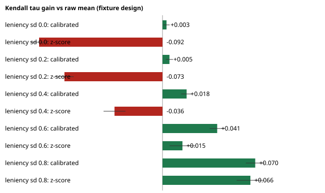

# Normalization proof

Generated by `tools/generate_proof.py` with the product engine (`src/engine`), 300 simulations per scenario. Every number here can be reproduced with one command and nothing but Python.

## 1. The fixture itself

- Duplicate merged: prj_07 → prj_41; 3 judges scored both copies, and disagreed with themselves by 1.33, 1.00, 1.00 points (a free test-retest noise measurement).
- Flat judge: jdg_07 (identical scores on every criterion of every review) → weight 0.
- Shrinkage chosen by REML: k = 18.78 (judge offsets are barely identifiable in this data).
- **Signal check: ICC(1) = -0.006, permutation p = 0.51.** The judges agree about which projects are better no more than chance would. **No method can recover a ranking from these scores**; the honest output is a list of ties, and Quorum says so on the results page.

| Rank | Project | n | Raw | Calibrated | ±SE | Plausible ranks (90%) | P(top 3) | vs raw |
|---:|---|---:|---:|---:|---:|---|---:|---:|
| 1 | Iron Switch | 3 | 4.33 | 4.32 | 0.37 | 1–15 | 51% | +0 |
| 2 | Salt Ledger | 4 | 4.33 | 4.32 | 0.32 | 1–13 | 52% | -1 |
| 3 | Dry Relay | 3 | 4.11 | 4.14 | 0.37 | 1–20 | 31% | +1 |
| 4 | Still Beacon | 2 | 4.17 | 4.11 | 0.46 | 1–25 | 32% | -1 |
| 5 | Salt Loom | 4 | 4.08 | 4.08 | 0.32 | 1–19 | 24% | +0 |
| 6 | Salt Kiln | 3 | 4.00 | 4.00 | 0.37 | 1–24 | 19% | +0 |
| 7 | Slow Trail | 3 | 4.00 | 3.99 | 0.37 | 2–24 | 19% | -1 |
| 8 | Copper Kiln | 3 | 3.89 | 3.88 | 0.37 | 2–28 | 11% | +0 |
| 9 | Deep Beacon | 3 | 3.78 | 3.80 | 0.37 | 3–30 | 8% | +1 |
| 10 | North Drift | 5 | 3.80 | 3.79 | 0.29 | 4–27 | 4% | -1 |
| 11 | Green Switch | 3 | 3.78 | 3.77 | 0.37 | 3–31 | 7% | -1 |
| 12 | Copper Orbit | 2 | 3.67 | 3.68 | 0.46 | 3–36 | 7% | +0 |

All 40 projects: raw rank → calibrated rank

| Project | Raw mean | Raw rank | Calibrated | Calibrated rank | Move |
|---|---:|---:|---:|---:|---:|
| Iron Switch | 4.333 | 1 | 4.323 | 1 | +0 |
| Salt Ledger | 4.333 | 1 | 4.321 | 2 | -1 |
| Still Beacon | 4.167 | 3 | 4.111 | 4 | -1 |
| Dry Relay | 4.111 | 4 | 4.135 | 3 | +1 |
| Salt Loom | 4.083 | 5 | 4.084 | 5 | +0 |
| Salt Kiln | 4.000 | 6 | 4.000 | 6 | +0 |
| Slow Trail | 4.000 | 6 | 3.988 | 7 | -1 |
| Copper Kiln | 3.889 | 8 | 3.882 | 8 | +0 |
| North Drift | 3.800 | 9 | 3.792 | 10 | -1 |
| Deep Beacon | 3.778 | 10 | 3.802 | 9 | +1 |
| Green Switch | 3.778 | 10 | 3.767 | 11 | -1 |
| Copper Orbit | 3.667 | 12 | 3.676 | 12 | +0 |
| Salt Drift | 3.667 | 12 | 3.656 | 13 | -1 |
| Small Relay | 3.667 | 12 | 3.333 | 30 | -18 |
| Salt Ferry | 3.556 | 15 | 3.543 | 14 | +1 |
| Small Meadow | 3.556 | 15 | 3.527 | 15 | +0 |
| Hollow Signal | 3.556 | 15 | 3.350 | 28 | -13 |
| Small Loom | 3.556 | 15 | 3.350 | 28 | -13 |
| Open Kiln | 3.500 | 19 | 3.527 | 16 | +3 |
| Glass Beacon | 3.500 | 19 | 3.500 | 17 | +2 |
| Paper Anchor | 3.500 | 19 | 3.465 | 18 | +1 |
| Warm Beacon | 3.467 | 22 | 3.447 | 21 | +1 |
| Open Beacon | 3.444 | 23 | 3.459 | 19 | +4 |
| Glass Signal | 3.444 | 23 | 3.450 | 20 | +3 |
| Dry Harbour | 3.444 | 23 | 3.442 | 22 | +1 |
| Flat Thread | 3.444 | 23 | 3.434 | 23 | +0 |
| Loud Ledger | 3.444 | 23 | 3.432 | 24 | -1 |
| Flat Meadow | 3.444 | 23 | 3.404 | 26 | -3 |
| Green Lantern | 3.400 | 29 | 3.409 | 25 | +4 |
| Flat Relay | 3.333 | 30 | 3.352 | 27 | +3 |
| Quiet Anchor | 3.333 | 30 | 3.318 | 31 | -1 |
| Deep Compass | 3.333 | 30 | 3.304 | 32 | -2 |
| Paper Thread | 3.222 | 33 | 3.212 | 33 | +0 |
| Amber Hours | 3.222 | 33 | 3.205 | 34 | -1 |
| Paper Harbour | 3.111 | 35 | 3.126 | 35 | +0 |
| Dry Bridge | 3.111 | 35 | 3.120 | 36 | -1 |
| Dry Compass | 3.111 | 35 | 3.099 | 37 | -2 |
| Slow Loom | 3.000 | 38 | 2.980 | 38 | +0 |
| North Compass | 2.889 | 39 | 2.882 | 39 | +0 |
| Slow Quarry | 2.889 | 39 | 2.878 | 40 | -1 |

### Judge spread, raw and calibrated

*Judge spread* is how differently the judges score the same projects. For each judge, take their weighted total minus the other judges' mean on the same project, averaged over their reviews. The spread is the standard deviation of that lean across the 27 judges with two or more co-judged reviews (the flat judge is excluded).

| Correction | Judge spread σ |
|---|---:|
| Raw (no correction) | 0.41 |
| **Quorum: REML-chosen shrinkage, k = 18.8** | 0.35 |
| forced k = 5 | 0.26 |
| forced k = 1 | 0.15 |
| forced k = 0.01 (no shrinkage) | 0.07 |

On the fixture, the raw spread by this measure is **0.41**. The DOGFOOD homepage quotes an uncalibrated spread of σ = 0.42 for the same data; its exact formula is not published. Quorum's calibration brings the spread to 0.35, **on purpose not lower**:

- **Most of this spread is noise.** The judges' agreement is at chance (ICC ≈ 0), and most judges reviewed only 1–11 projects. A judge who drew three weak projects looks harsh by accident.
- **REML estimates how much of the spread is real leniency**, and shrinks each judge's offset by how much evidence supports it. Forcing weak shrinkage (k = 1) makes the judges look alike (σ ≈ 0.15), but only by treating noise as leniency and moving projects because of it.
- **The goal is recovering the true order, not a small σ.** Section 2 runs this exact design with known truth. Calibration beats the raw mean when leniency is real, and costs nothing when it is not.

Largest moves, explained exactly (raw mean + one line per judge = calibrated score):

- **Small Relay** (12 → 30): raw 3.667 · jdg_07 (excluded: gave 4 to everything) -0.333 · jdg_29 (near-average judge) -0.001 = **3.333**
- **Hollow Signal** (15 → 28): raw 3.556 · jdg_07 (excluded: gave 4 to everything) -0.222 · jdg_27 (near-average judge) +0.017 · jdg_29 (near-average judge) -0.000 = **3.350**
- **Small Loom** (15 → 28): raw 3.556 · jdg_07 (excluded: gave 4 to everything) -0.222 · jdg_27 (near-average judge) +0.017 · jdg_29 (near-average judge) -0.000 = **3.350**
- **Open Beacon** (23 → 19): raw 3.444 · jdg_14 (near-average judge) +0.015 · jdg_22 (near-average judge) -0.012 · jdg_24 (near-average judge) +0.011 = **3.459**
- **Green Lantern** (29 → 25): raw 3.400 · jdg_14 (near-average judge) +0.009 · jdg_22 (near-average judge) -0.007 · jdg_24 (near-average judge) +0.007 · jdg_04 (near-average judge) +0.004 · jdg_11 (near-average judge) -0.004 = **3.409**

## 2. Simulation on the fixture's exact design

Truth is known. Each review is `round(3.4 + quality + judge leniency + noise)`, clipped to 1–5, on 3 criteria, over the fixture's 123 judge–project pairs, with jdg_07 always giving 3. Ties in any method's scores are broken identically at random (Kendall's τ-b otherwise rewards the exact ties of raw integer means). Entries are paired differences against the raw mean, with 95% intervals.

| Judge leniency spread (sd) | Raw τ | z-score − raw | **Calibrated − raw** | P(true #1 ranked #1): raw / z / calibrated |
|---|---:|---:|---:|---|
| 0.0 | 0.621 | -0.092 ± 0.006 | **+0.003 ± 0.002** | 40% / 26% / 39% |
| 0.2 | 0.603 | -0.073 ± 0.007 | **+0.005 ± 0.003** | 37% / 25% / 38% |
| 0.4 | 0.561 | -0.036 ± 0.008 | **+0.018 ± 0.004** | 29% / 23% / 35% |
| 0.6 | 0.509 | +0.015 ± 0.010 | **+0.041 ± 0.006** | 25% / 27% / 32% |
| 0.8 | 0.457 | +0.066 ± 0.010 | **+0.070 ± 0.007** | 22% / 24% / 29% |

Reading it: when judges differ in leniency, calibration recovers the true order better than the raw mean, and the gain grows with the spread. When they do not, it costs nothing measurable, because REML chooses a large k and the estimator collapses to the raw mean. Per-judge z-scores are worse than calibration in every scenario: they are undefined for single-review and flat judges, and they punish projects that a judge happened to review alongside strong ones.

## 3. Assignment is part of the measurement

40 projects, 30 judges, 3 reviews each, leniency sd 0.5. The same calibration, two assignment designs:

| Design | Calibrated − raw (τ) |
|---|---:|
| disjoint panels | +0.000 ± 0.000 |
| overlap-aware (Quorum) | +0.036 ± 0.008 |

With disjoint panels the gain is exactly zero, and not by chance: when every project in a panel was reviewed by the same judges, each judge's offset shifts all of that panel's projects equally, so the calibrated score is provably identical to the raw mean. A harsh panel and a weak batch of projects are indistinguishable. When batches overlap, leniency becomes measurable. That is why Quorum's assignment planner maximises overlap and reports the judge graph's connectivity before anything is committed.

## 4. Focus rounds and tie-breaks

The allocation experiments (400 seeds, ICC ≈ 0.31) are in `research/math/results_adaptive.txt`. With the same 120 reviews, 2 each plus two targeted rounds of 20 picked the true winner 43.5% of the time vs 33.5% for uniform 3 each; adding the pairwise tie-break raised it to 53.5% (persistent-impression noise, the conservative case).

_Generated in 58s._
